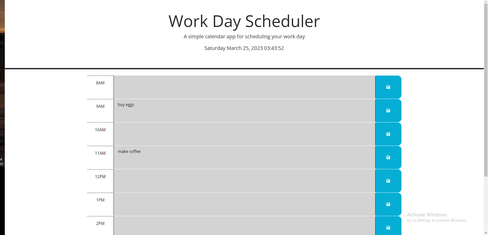

# Work-day

## Description

In this project, my task was to finish a set of starter code that I was given. This code involved making a calendar scheduling system. I had to make a time and text area for every hour in a working day along with supplying the date and time. Then have a save button that displayed the user's input after refresh.

## Licenses

MIT License

## Screenshots

## Link to deployed webpage

https://spzweifel.github.io/Work-day/